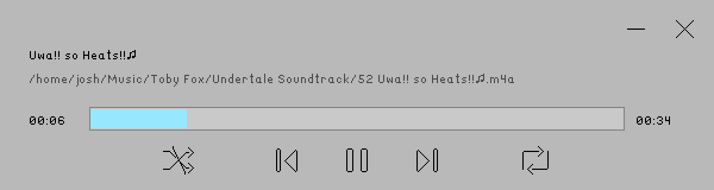
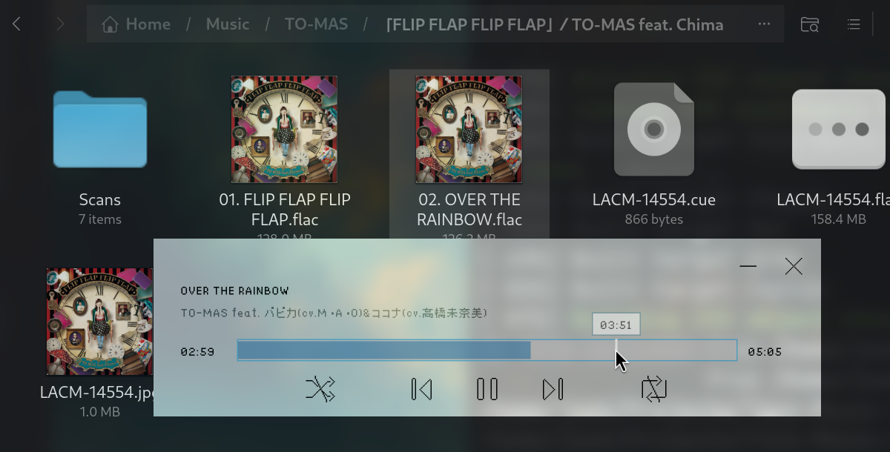

# Tiny Music Player

A bloat-free music player built with C++ and [raylib](https://www.raylib.com/).

## About The Project

This program is mainly for my personal use. Currently, it only supports Linux.

The main motivation for creating this program is that I wanted something dead simple: I just click a music file, and it plays.

Before this, I was using [Decibels](https://apps.gnome.org/Decibels/). It was great, but the problem was that it launched music in a new instance, and I had no way to configure it. Also, while I don't want a full-blown playlist like [Amberol](https://apps.gnome.org/Amberol/), I do want the ability to navigate files in the current directory. So, I created this program specifically to meet my needs.

## Features

- Supports pretty much all common audio formats (thanks to FFmpeg).
- No bloat (not even playlists), just the basic controls and a simple directory loop feature.

## Build

### Prerequisites

- C++23 compiler
- CMake

### Dependencies

Automatically managed by CMake.

- [raylib](https://github.com/raysan5/raylib) - Rendering
- [raygui](https://github.com/raysan5/raygui) - UI components
- [fmt](https://github.com/fmtlib/fmt) - Formatting
- [FFmpeg](https://ffmpeg.org/) - Audio decoding

### Build Instructions

Just let CMake do its magic.

## LICENSE
    Tiny Music Player
    A bloat-free music player.
    Copyright (C) 2026  Joshua Lam <me[at]joshlam.dev>

    This program is free software: you can redistribute it and/or modify
    it under the terms of the GNU General Public License as published by
    the Free Software Foundation, either version 3 of the License, or
    (at your option) any later version.

    This program is distributed in the hope that it will be useful,
    but WITHOUT ANY WARRANTY; without even the implied warranty of
    MERCHANTABILITY or FITNESS FOR A PARTICULAR PURPOSE.  See the
    GNU General Public License for more details.

    You should have received a copy of the GNU General Public License
    along with this program.  If not, see <https://www.gnu.org/licenses/>.